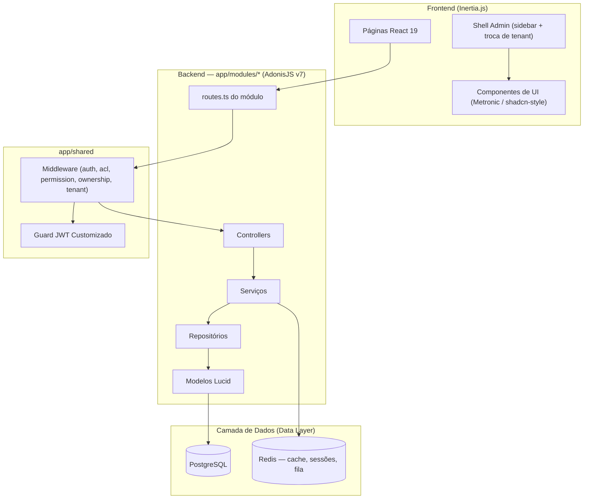

<h1 align="center">Benício</h1>

<p align="center">Plataforma jurídica para organizar escritórios, equipes e fluxos de trabalho.</p>

<p align="center">
  <a href="https://github.com/gabrielmaialva33/benicio/actions/workflows/ci-cd.yml">
    
  </a>
  
  
  
  <a href="https://github.com/gabrielmaialva33/benicio/commits/master">
    
  </a>
</p>

<p align="center">
    <a href="README.md">Inglês</a>
    ·
    <a href="README-pt.md">Português</a>
</p>

<p align="center">
  <a href="#bookmark-sobre">Sobre</a>&nbsp;&nbsp;&nbsp;|&nbsp;&nbsp;&nbsp;
  <a href="#status-atual">Status atual</a>&nbsp;&nbsp;&nbsp;|&nbsp;&nbsp;&nbsp;
  <a href="#computer-tecnologias">Tecnologias</a>&nbsp;&nbsp;&nbsp;|&nbsp;&nbsp;&nbsp;
  <a href="#package-instalação">Instalação</a>&nbsp;&nbsp;&nbsp;|&nbsp;&nbsp;&nbsp;
  <a href="#whale-docker">Docker</a>&nbsp;&nbsp;&nbsp;|&nbsp;&nbsp;&nbsp;
  <a href="#memo-licença">Licença</a>
</p>

## :bookmark: Sobre

O **Benício** é uma plataforma de gestão jurídica para organizar escritórios, equipes e fluxos de trabalho. Este é o
repositório canônico do produto: aplicação web em **React 19 + Inertia.js**, API REST versionada e backend em
**AdonisJS v7**, todos apoiados pela mesma camada de domínio.

A fundação atual já entrega autenticação multi-guard, controle de acesso baseado em papéis (RBAC), **multi-tenancy N:N**,
auditoria e gerenciamento de arquivos. Os módulos jurídicos do legado serão migrados incrementalmente, começando pelo
fluxo de pastas e processos, sempre com dados reais e testes de contrato.

### 🏗️ Visão Geral da Arquitetura

O backend é **modular (orientado a domínio)**: cada domínio (`auth`, `users`, `roles`, `permissions`, `files`, `audits`,
`tenants`, `health`, `web` e, progressivamente, os módulos jurídicos) é dono dos seus controllers, serviços, repositórios, modelos, validators e rotas em
`app/modules/<domínio>/`. Código transversal (middleware, guard JWT, repositório/modelos base) fica em `app/shared/`, e
as exceptions tipadas em `app/exceptions/`.



## Status atual

- **Fundação disponível**: autenticação, usuários, tenants, RBAC, auditoria, arquivos, shell web e infraestrutura de API.
- **Fundação jurídica disponível**: clientes e pastas tenant-safe, com schema revisado, RBAC, validação, soft delete e testes do contrato REST.
- **Próximo slice**: processos e importações orientadas à origem, mantendo CNJ, partes, tribunal e valores jurídicos fora do agregado de pasta.
- **Web canônica**: controllers Inertia finos reutilizam os mesmos serviços de aplicação da API.
- **Mobile**: o cliente Flutter será conectado quando o contrato REST v1 estiver estabilizado e coberto por testes.

## 🌟 Principais Funcionalidades

- **🔐 Autenticação Multi-Guard**: Quatro guards prontos — JWT (padrão, cookie + header), API access tokens, sessão e
  basic auth.
- **👥 Controle de Acesso Avançado (RBAC)**: Papéis, permissões, permissões diretas no usuário, herança de papéis e
  checagem de permissão com cache.
- **🏢 Multi-Tenancy (N:N)**: Usuários pertencem a vários tenants via pivot `user_tenants` (com papéis
  `owner`/`admin`/`member`). O tenant ativo viaja no JWT e é alternável por endpoints de API e web.
- **📁 Gerenciamento de Arquivos**: Serviço de upload pré-configurado com suporte para drivers local, S3, Spaces, R2 e
  GCS.
- **⚡️ Reatividade Full-Stack**: O poder do React combinado com a simplicidade de uma aplicação tradicional renderizada
  no servidor, graças ao Inertia.js.
- **🎨 Biblioteca de Componentes de UI**: ~78 componentes Metronic (estilo shadcn) sobre Radix UI, Tailwind CSS v4 e
  `lucide-react`, além de um shell admin com sidebar, troca de tenant e alternância de tema.
- **✅ Stack Type-Safe**: TypeScript de ponta a ponta com checagem de tipos no backend e no frontend.
- **🏥 Health Checks**: Endpoint de verificação de saúde integrado para monitoramento.

## :computer: Tecnologias

### Núcleo

- **[AdonisJS v7](https://adonisjs.com/)**: Um framework Node.js robusto para o backend (roda TypeScript direto via `@poppinss/ts-exec`).
- **[Node.js 24 LTS](https://nodejs.org/)**: O runtime (`.nvmrc` → `v24.13.0`).
- **[React 19](https://react.dev/)**: Uma poderosa biblioteca para construir interfaces de usuário.
- **[Inertia.js v3](https://inertiajs.com/)**: A cola que conecta o frontend moderno com o backend.
- **[TypeScript](https://www.typescriptlang.org/)**: Para segurança de tipos em toda a stack.
- **[PostgreSQL](https://www.postgresql.org/)**: Um banco de dados relacional confiável e poderoso (SQLite disponível para testes).
- **[Redis](https://redis.io/)**: Usado para cache, sessões e a fila Bull.
- **[Vite](https://vitejs.dev/)**: Para uma experiência de desenvolvimento frontend ultrarrápida.
- **[Tailwind CSS v4](https://tailwindcss.com/)**: Framework CSS utility-first que sustenta a biblioteca de componentes Metronic.

### Bibliotecas de frontend

- **[TanStack Table v9](https://tanstack.com/table)**: Data grids headless (os componentes `DataGrid` em `inertia/components/ui/`).
- **[TanStack Query](https://tanstack.com/query)**: Cache de estado de servidor para requisições no cliente.
- **[React Hook Form](https://react-hook-form.com/)** + **[Zod](https://zod.dev/)**: Estado de formulários e validação por schema.
- **[Radix UI](https://www.radix-ui.com/)** + **[lucide-react](https://lucide.dev/)**: Primitivos e ícones por trás da biblioteca de componentes.
- **[Recharts](https://recharts.org/)**, **[dnd-kit](https://dndkit.com/)**, **[Motion](https://motion.dev/)**: Gráficos, drag-and-drop e animação.

### Bibliotecas de backend

- **[Lucid ORM](https://lucid.adonisjs.com/)**: Models, migrations e query builder com estratégia de nomes em snake_case.
- **[VineJS](https://vinejs.dev/)**: Validação de requisições na borda do sistema.
- **[Bull Queue](https://github.com/RomainLanz/adonis-bull-queue)**: Jobs em background sobre o Redis.

### Testes

- **[Japa](https://japa.dev/)**: Suítes de backend unit, functional e browser (browser via Playwright).
- **[Vitest](https://vitest.dev/)** + **[Testing Library](https://testing-library.com/)** + **[MSW](https://mswjs.io/)**: Testes do frontend.

> **Nota sobre o TypeScript.** A dependência `typescript` está apontada para
> `@typescript/typescript6`, enquanto o TS 7 entra como `typescript-native`. O `typescript-eslint`
> ainda não suporta a API do TS 7 ([#10940](https://github.com/typescript-eslint/typescript-eslint/issues/10940))
> e resolve o TypeScript via peer dependency, então os dois rodam lado a lado: o ESLint usa a API do
> TS 6 e o `pnpm typecheck`/`pnpm build` usam o `tsc` do TS 7. Volte a ter uma única entrada
> `typescript` assim que o typescript-eslint acompanhar.

## :package: Instalação

### ✔️ Pré-requisitos

- **Node.js 24 LTS** (`.nvmrc` → `v24.13.0`)
- **pnpm**
- **PostgreSQL** e **Redis** — ambos obrigatórios para dev _e_ testes. O jeito mais rápido de subir
  os dois é `docker compose up -d postgres redis` (veja [Docker](#whale-docker)).

### 🚀 Começando

1. **Clone o repositório:**

   ```sh
   git clone https://github.com/gabrielmaialva33/benicio.git
   cd benicio
   ```

2. **Instale as dependências:**

   ```sh
   pnpm install
   ```

3. **Configure as variáveis de ambiente:**

   ```sh
   cp .env.example .env
   ```

   _Abra o arquivo `.env` e configure suas credenciais de banco de dados e outras configurações._

4. **Suba o PostgreSQL e o Redis:**

   ```sh
   docker compose up -d postgres redis
   ```

   _Pule este passo se você já roda os dois serviços localmente._

5. **Execute as migrações do banco de dados (e o seed):**

   ```sh
   pnpm ace migration:run
   pnpm ace db:seed
   ```

6. **Inicie o servidor de desenvolvimento:**
   ```sh
   pnpm dev
   ```
   _Sua aplicação estará disponível em `http://localhost:3333`._

### 📜 Scripts Disponíveis

| Script               | O que faz                                                               |
| -------------------- | ----------------------------------------------------------------------- |
| `pnpm dev`           | Inicia o servidor de desenvolvimento com HMR.                           |
| `pnpm build`         | Compila a aplicação para produção.                                      |
| `pnpm start`         | Executa o servidor pronto para produção (`node bin/server.js`).         |
| `pnpm ace <cmd>`     | Roda qualquer comando ace do AdonisJS (ex.: `pnpm ace migration:run`).  |
| `pnpm test`          | Executa os testes unitários do backend (Japa).                          |
| `pnpm test:e2e`      | Executa todas as suítes do backend (unit + functional + browser).       |
| `pnpm test:ui`       | Executa os testes do frontend (Vitest).                                 |
| `pnpm test:ui:watch` | Testes do frontend em modo watch.                                       |
| `pnpm typecheck`     | Verifica os tipos no backend e no frontend.                             |
| `pnpm lint`          | Verifica o código com o linter.                                         |
| `pnpm lint:fix`      | Verifica e corrige automaticamente os fontes do backend.                |
| `pnpm format`        | Formata o código com o Prettier.                                        |
| `pnpm docker`        | Roda migrations, seeds e sobe o servidor (usado como CMD do container). |

> **Nota:** não existe mais `node ace` — o AdonisJS v7 roda TypeScript diretamente, então todo
> comando ace passa por `pnpm ace <cmd>`.

## :whale: Docker

O projeto já vem com um `Dockerfile` (multi-stage, com target `production`) e um
`docker-compose.yml`.

**Só os datastores** — o cenário mais comum, com a aplicação rodando na máquina via `pnpm dev`:

```sh
docker compose up -d postgres redis
```

**Stack completa** — aplicação, PostgreSQL e Redis todos em containers:

```sh
docker compose up --build
```

O container da aplicação espera os healthchecks dos dois serviços, roda migrations e seeders e só
então sobe o servidor em `http://localhost:3333`. O compose traz um `APP_KEY` de placeholder; gere
uma chave real e exporte antes de rodar a stack completa em qualquer coisa além de um ambiente
descartável:

```sh
export APP_KEY=$(pnpm ace generate:key --show | cut -d' ' -f3)
```

_O `--show` imprime `APP_KEY = <chave>` em vez de escrever no `.env` — daí o `cut`._

> A porta 3333 precisa estar livre — se você já tem um `pnpm dev` rodando na máquina, o container da
> aplicação não vai conseguir fazer o bind.

## :test_tube: Integração Contínua

Todo push para `master`/`develop` e todo PR para `master` dispara o
[workflow de CI](.github/workflows/ci-cd.yml): lint, checagem de tipos (backend + frontend), a suíte
completa do backend (unit + functional + browser no Playwright Chromium), os testes do frontend e um
build de produção — contra containers reais de PostgreSQL e Redis.

## :memo: Licença

Este projeto está licenciado sob a **Licença MIT**. Veja o arquivo [LICENSE](LICENSE) para mais detalhes.

---

<p align="center">
  Benício — operação jurídica organizada.
</p>
