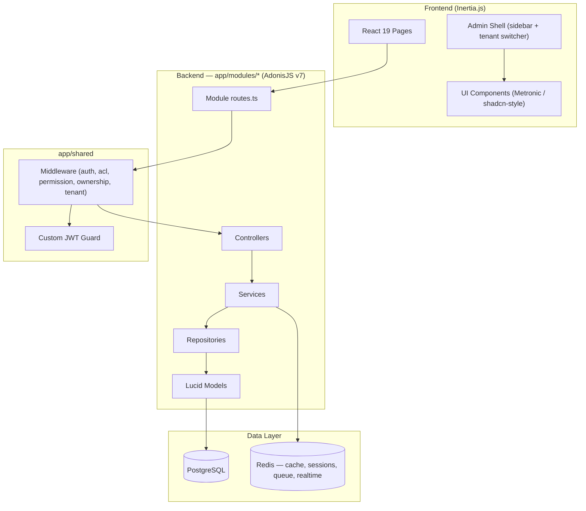

<h1 align="center">Benício</h1>

<p align="center">A legal operations platform for firms, teams, and their daily workflows.</p>

<p align="center">
  <a href="https://github.com/gabrielmaialva33/benicio/actions/workflows/ci-cd.yml">
    
  </a>
  
  
  
  <a href="https://github.com/gabrielmaialva33/benicio/commits/master">
    
  </a>
</p>

<p align="center">
    <a href="README.md">English</a>
    ·
    <a href="README-pt.md">Portuguese</a>
</p>

<p align="center">
  <a href="#bookmark-about">About</a>&nbsp;&nbsp;&nbsp;|&nbsp;&nbsp;&nbsp;
  <a href="#current-status">Current Status</a>&nbsp;&nbsp;&nbsp;|&nbsp;&nbsp;&nbsp;
  <a href="#computer-technologies">Technologies</a>&nbsp;&nbsp;&nbsp;|&nbsp;&nbsp;&nbsp;
  <a href="#package-installation">Installation</a>&nbsp;&nbsp;&nbsp;|&nbsp;&nbsp;&nbsp;
  <a href="#whale-docker">Docker</a>&nbsp;&nbsp;&nbsp;|&nbsp;&nbsp;&nbsp;
  <a href="#memo-license">License</a>
</p>

## :bookmark: About

**Benício** is a legal operations platform for organizing firms, teams, and their workflows. This is the product's
canonical repository: a **React 19 + Inertia.js** web application, a versioned REST API, and an **AdonisJS v7** backend,
all backed by the same domain layer.

The current foundation already provides multi-guard authentication, role-based access control (RBAC), **N:N
multi-tenancy**, auditing, and file management. Dashboard, clients, folders, processes, and AI chat are now consolidated
in Inertia; the remaining operational modules will follow the same incremental migration, always backed by real data and
contract tests.

### 🏗️ Architecture Overview

The backend is **modular (domain-driven)**: each domain (`auth`, `users`, `roles`, `permissions`, `files`, `audits`,
`tenants`, `health`, `web`, and the legal workflow modules) owns its controllers, services, repositories, models, validators, and routes under
`app/modules/<domain>/`. Cross-cutting code (middleware, JWT guard, base repository/models) lives in `app/shared/`, and
typed exceptions in `app/exceptions/`.



The dependency direction is deliberate: controllers own HTTP concerns, services own use-case orchestration and
transaction boundaries, and repositories own every Lucid/SQL query. ESLint rejects database/query-builder calls in
controllers, services, and middleware, and also rejects controllers or middleware that bypass services by importing a
repository directly.

## Current Status

- **Platform foundation available**: rotating refresh-token families, users, tenants, RBAC, auditing, files, the web shell, and API infrastructure.
- **Legal API available**: tenant-safe clients, folders, processes/parties, tasks, hearings, deadlines, movements, append-only activity, file-linked documents, and per-user favorites.
- **Operations available**: real dashboard aggregates, recipient-owned notifications, internal messages, private realtime channels, and persisted AI conversations with an explicit provider boundary.
- **Contract covered**: every public API/Transmit route is represented in `docs/openapi.yaml`, with functional tests for tenant and owner isolation.
- **Canonical web**: the approved `yol-benicio` experience now lives in Inertia, including dashboard, tenant-safe
  folders and clients, processes nested under folders, and persisted AI chat with real SSE streaming.
- **Next product slice**: expose the remaining operational API modules (tasks, hearings, deadlines, movements, and
  documents) through the same Inertia architecture.

## 🌟 Key Features

- **🔐 Multi-Guard Authentication**: Four guards out of the box — JWT (default, cookie + header), API access tokens,
  session, and basic auth.
- **👥 Advanced Role-Based Access Control (RBAC)**: Roles, permissions, direct user permissions, role inheritance, and
  cached permission checks.
- **🏢 Multi-Tenancy (N:N)**: Users belong to many tenants via a `user_tenants` pivot (with `owner`/`admin`/`member`
  roles). The active tenant is carried in the JWT and switchable through both API and web endpoints.
- **📁 File Management**: Pre-configured file upload service with support for local, S3, Spaces, R2, and GCS drivers.
- **⚖️ Legal Workflows**: Cases, tasks, hearings, deadlines, movements, activity timelines, file-linked documents, and user-scoped favorites.
- **📊 Operational Read Models**: Tenant-scoped dashboard aggregates and widgets backed by real PostgreSQL queries.
- **📨 Private Realtime**: Persisted notifications and internal messages delivered over authenticated Transmit/SSE channels.
- **🤖 Provider-Backed AI Chat**: User-owned conversation history, concurrency control, safe failure states, and OpenAI-compatible streaming without a production mock fallback.
- **⚡️ Full-Stack Reactivity**: The power of React combined with the simplicity of a traditional server-rendered app,
  thanks to Inertia.js.
- **🎨 UI Component Library**: ~78 Metronic (shadcn-style) components built on Radix UI, Tailwind CSS v4, and
  `lucide-react`, plus an admin shell with sidebar, tenant switcher, and theme toggle.
- **✅ Type-Safe Stack**: End-to-end TypeScript with type checking across backend and frontend.
- **🏥 Health Checks**: Integrated health check endpoint for monitoring.

## :computer: Technologies

### Core

- **[AdonisJS v7](https://adonisjs.com/)**: A robust Node.js framework for the backend (runs TypeScript directly via `@poppinss/ts-exec`).
- **[Node.js 24 LTS](https://nodejs.org/)**: The runtime (`.nvmrc` → `v24.13.0`).
- **[React 19](https://react.dev/)**: A powerful library for building user interfaces.
- **[Inertia.js v3](https://inertiajs.com/)**: The glue that connects the modern frontend with the backend.
- **[TypeScript](https://www.typescriptlang.org/)**: For type safety across the entire stack.
- **[PostgreSQL](https://www.postgresql.org/)**: A reliable and powerful relational database (SQLite available for tests).
- **[Redis](https://redis.io/)**: Used for caching, sessions, rate limiting, jobs, and realtime distribution.
- **[Vite](https://vitejs.dev/)**: For a lightning-fast frontend development experience.
- **[Tailwind CSS v4](https://tailwindcss.com/)**: A utility-first CSS framework powering the Metronic component library.

### Frontend libraries

- **[TanStack Table v9](https://tanstack.com/table)**: Headless data grids (the `DataGrid` components under `inertia/components/ui/`).
- **[TanStack Query](https://tanstack.com/query)**: Server-state caching for client-side fetches.
- **[React Hook Form](https://react-hook-form.com/)** + **[Zod](https://zod.dev/)**: Form state and schema validation.
- **[Radix UI](https://www.radix-ui.com/)** + **[lucide-react](https://lucide.dev/)**: Primitives and icons behind the component library.
- **[Recharts](https://recharts.org/)**, **[dnd-kit](https://dndkit.com/)**, **[Motion](https://motion.dev/)**: Charts, drag-and-drop, and animation.

### Backend libraries

- **[Lucid ORM](https://lucid.adonisjs.com/)**: Models, migrations, and query building with a snake_case naming strategy.
- **[VineJS](https://vinejs.dev/)**: Request validation at the edge.
- **[AdonisJS Queue](https://docs.adonisjs.com/guides/digging-deeper/queues)**: Official background jobs over Redis, pinned while its API is experimental.
- **[AdonisJS Transmit](https://docs.adonisjs.com/guides/digging-deeper/server-sent-events)**: Authenticated Server-Sent Events with Redis-backed distribution.

### Testing

- **[Japa](https://japa.dev/)**: Backend unit, functional, and browser suites (browser via Playwright).
- **[Vitest](https://vitest.dev/)** + **[Testing Library](https://testing-library.com/)** + **[MSW](https://mswjs.io/)**: Frontend tests.

> **Note on TypeScript.** The `typescript` dependency is aliased to
> `@typescript/typescript6` while TS 7 ships as `typescript-native`. `typescript-eslint` does not
> support the TS 7 API yet ([#10940](https://github.com/typescript-eslint/typescript-eslint/issues/10940))
> and resolves TypeScript through a peer dependency, so the two run side by side: ESLint gets the
> TS 6 API, while `pnpm typecheck` and `pnpm build` use the TS 7 `tsc`. Collapse them back into a
> single `typescript` entry once typescript-eslint catches up.

## :package: Installation

### ✔️ Prerequisites

- **Node.js 24 LTS** (`.nvmrc` → `v24.13.0`)
- **pnpm**
- **PostgreSQL** and **Redis** — both are required for dev _and_ tests. The quickest way to get them
  is `docker compose up -d postgres redis` (see [Docker](#whale-docker)).

### 🚀 Getting Started

1. **Clone the repository:**

   ```sh
   git clone https://github.com/gabrielmaialva33/benicio.git
   cd benicio
   ```

2. **Install dependencies:**

   ```sh
   pnpm install
   ```

3. **Setup environment variables:**

   ```sh
   cp .env.example .env
   ```

   _Open the `.env` file and configure your database credentials and other settings._

   AI chat is fail-closed by default. To enable an OpenAI-compatible provider, set
   `AI_PROVIDER=openai_compatible`, `AI_BASE_URL`, `AI_MODEL`, and (when required) `AI_API_KEY`.
   The base URL must expose `POST /chat/completions`; no fake provider is used outside tests.

4. **Start PostgreSQL and Redis:**

   ```sh
   docker compose up -d postgres redis
   ```

   _Skip this if you already run both services locally._

5. **Run database migrations (and seed):**

   ```sh
   pnpm ace migration:run
   pnpm ace db:seed
   ```

   In development, the seed is deterministic and idempotent. It creates the tenant-aware legal
   demo scenario and the primary local account `admin@benicio.com.br` / `benicio123`. Running it
   again updates the managed fixture instead of duplicating records; access tokens, refresh tokens,
   and rate-limit state are intentionally not seeded.

6. **Start the development server:**
   ```sh
   pnpm dev
   ```
   _Your application will be available at `http://localhost:3333`._

### 📜 Available Scripts

| Script               | What it does                                                        |
| -------------------- | ------------------------------------------------------------------- |
| `pnpm dev`           | Starts the development server with HMR.                             |
| `pnpm build`         | Compiles the application for production.                            |
| `pnpm start`         | Runs the production-ready server (`node bin/server.js`).            |
| `pnpm ace <cmd>`     | Runs any AdonisJS ace command (e.g. `pnpm ace migration:run`).      |
| `pnpm test`          | Executes backend unit tests (Japa).                                 |
| `pnpm test:e2e`      | Executes all backend suites (unit + functional + browser).          |
| `pnpm test:ui`       | Executes frontend tests (Vitest).                                   |
| `pnpm test:ui:watch` | Frontend tests in watch mode.                                       |
| `pnpm typecheck`     | Type-checks both backend and frontend.                              |
| `pnpm lint`          | Lints the codebase.                                                 |
| `pnpm lint:fix`      | Lints and auto-fixes the backend sources.                           |
| `pnpm format`        | Formats the code with Prettier.                                     |
| `pnpm docker`        | Migrates, seeds, then boots the server (used as the container CMD). |

> **Note:** there is no `node ace` anymore — AdonisJS v7 runs TypeScript directly, so every ace
> command goes through `pnpm ace <cmd>`.

## :whale: Docker

A `Dockerfile` (multi-stage, with a `production` target) and a `docker-compose.yml` ship with the
project.

**Datastores only** — the common setup, with the app running on the host via `pnpm dev`:

```sh
docker compose up -d postgres redis
```

**Full stack** — app, PostgreSQL, and Redis all containerized:

```sh
docker compose up --build
```

The app container waits for both healthchecks, then runs migrations and seeders before starting the
server on `http://localhost:3333`. Compose ships a placeholder `APP_KEY`; generate a real one and
export it before running the full stack in anything but a scratch environment:

```sh
export APP_KEY=$(pnpm ace generate:key --show | cut -d' ' -f3)
```

_`--show` prints `APP_KEY = <key>` instead of writing it into `.env`, hence the `cut`._

> Port 3333 must be free — if you already have `pnpm dev` running on the host, the app container
> will fail to bind.

## :test_tube: Continuous Integration

Every push to `master`/`develop` and every PR against `master` runs the
[CI workflow](.github/workflows/ci-cd.yml): lint, type check (backend + frontend), the full backend
suite (unit + functional + browser on Playwright Chromium), the frontend tests, and a production
build — against real PostgreSQL and Redis service containers.

## :memo: License

This project is licensed under the **MIT License**. See the [LICENSE](LICENSE) file for details.

---

<p align="center">
  Benício — legal operations, organized.
</p>
